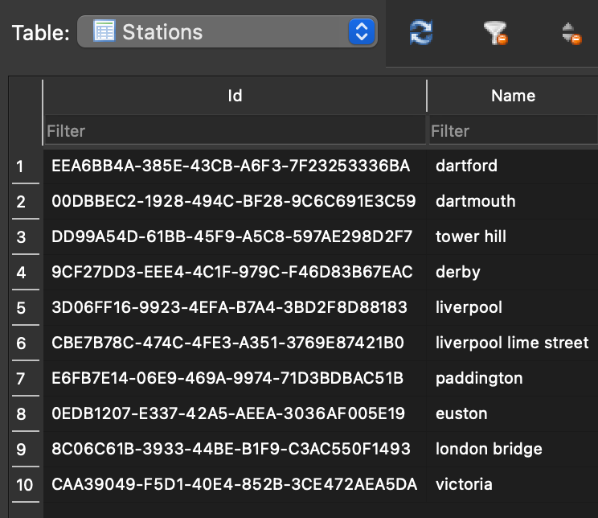
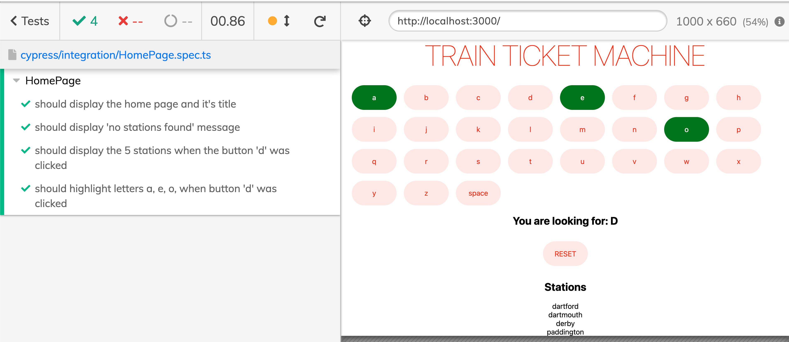
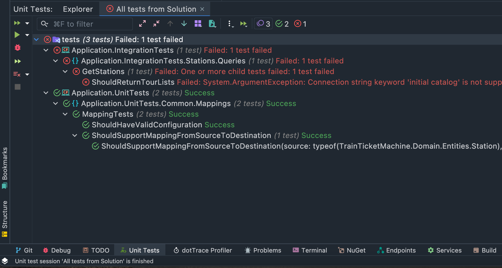

# Train Ticket Machine Fullstack
## ASP.NET Core Net 6
- swagger: https://localhost:7168/swagger/index.html
- endpoint: https://localhost:7168/api/v1/Stations


## Svelte 3 plus TypeScript and Vite
- https://localhost:3000/
- to run:

```bash
npm install --force
npm run dev
npm run test
```

---
#### Client App


---
#### Sample Data in SQLite


---
#### Svelte Automated Tests



---
#### ASP.NET Core 6 Automated Tests


---
#### Test Db is SQL Server while Prod is SQLite to quickly run the app locally for POC purposes